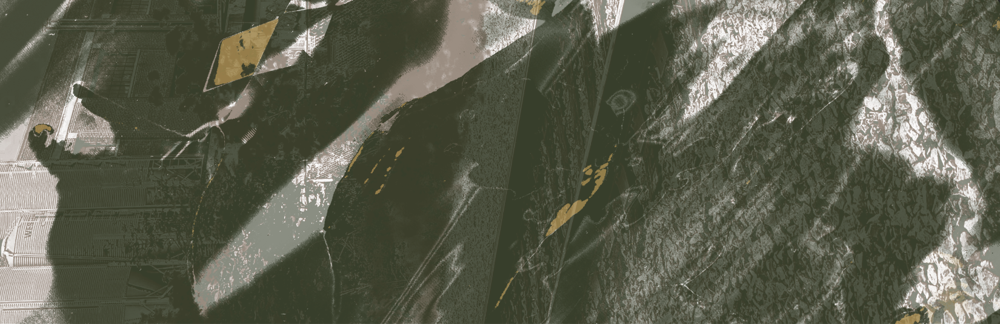

# Prototyping: Website

Benjy M.

## Description

This is the repository for my prototyping work in CART 253.

:

> 

## Prototyping: Instructions

1. Big Happy Day
> 

2.
(topics/prototypes/assets/images/p2.png)

3.
(topics/prototypes/assets/images/p3.png)

## Attribution

This bit should attribute any code, assets or other elements used taken from other sources. For example:

> - This project uses [p5.js](https://p5js.org).
> - I made the banner image.

## License

> This project is licensed under a Creative Commons Attribution ([CC BY 4.0](https://creativecommons.org/licenses/by/4.0/deed.en)) license with the exception of libraries and other components with their own licenses.
